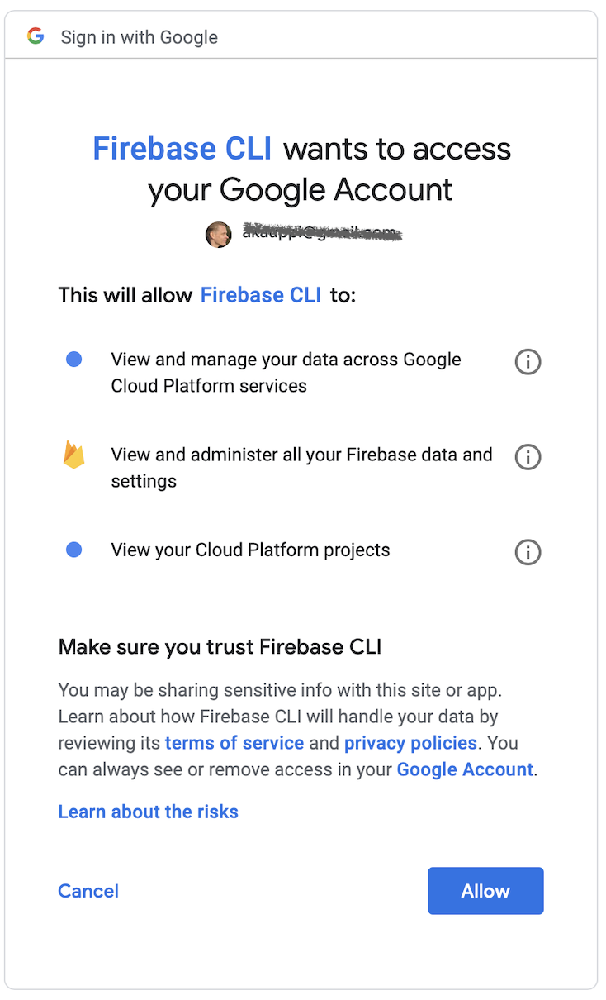

# cicp-proto

Simple proof-ground of how Google [Cloud Identity for Customers and Partners](https://cloud.google.com/identity-cp/) can be made to work.

Intentionally omits any web framework.

Based on the [Firenotes](https://github.com/GoogleCloudPlatform/python-docs-samples/tree/master/appengine/standard/firebase/firenotes) (GitHub) Google-provided sample, but unlike that one:

- login handled on a separate page (in Firenote's `index.html`, there are two "logged in" and "logged out" sections)

## Aim

Authentication needs are slightly app specific. Here's our chosen playing field.

- **No guests** - all access to the app must start with an authentication
- **Session cookies** used for passing the login status
- **Just pasting in a URL should work**
	- If already logged in, one gets directly to the page.
	- If not logged in, one should eventually land in that view [^1]
- **Single-page web app** that interfaces with a back-end REST API that uses authentication and needs to be able to validate it.

[^1]: This is a no-brainer but there are web apps that take one to a default page, instead.

Once you are in, you should be able to:

- see your logged in identity (something like `index.html#me`)
- see who other people have signed-up and maybe when (something like `index.html#others`)

The back-end service can be run just in-memory, without persistence.

When you want out, we offer:

- sign-out
- sign-off (being forgotten)

i.e. the user's id is likely shown in top right, with these options, if logged in.

### We're not into Firebase...

Though CICP is related to Firebase and we cannot quite avoid touching it, we wish to remain as independent of it as possible.


## Path so far..

Decided to not go [this way](https://medium.com/@evangow/server-authentication-basics-express-sessions-passport-and-curl-359b7456003d) (blog Oct 2017), since it gets complicated and needs a database. We want to store a JWT token in a session cookie.

Then [this](https://www.codementor.io/mayowa.a/how-to-build-a-simple-session-based-authentication-system-with-nodejs-from-scratch-6vn67mcy3) (blog Apr 2017) 

Then [this](https://paweljw.github.io/2017/09/vue.js-front-end-app-part-3-authentication/) (blog Sep 2017)

Picked this project up in Aug 2019. [...]


## Requirements

- `npm`
- `sbt`


### Firebase project

Create a project in the Firebase console.

Enable the following authentication mechanisms for it:

- [Email link authentication](https://firebase.google.com/docs/auth/web/email-link-auth)
- [Google sign-in](https://firebase.google.com/docs/auth/web/google-signin)
- [GitHub](https://firebase.google.com/docs/auth/web/github-auth)
- [Microsoft](https://firebase.google.com/docs/auth/web/microsoft-oauth)

Pick the configuration entry from [Firebase console](https://console.firebase.google.com) > (project) > `Project Settings` > `Web apps`[^2] to `static/index.html`.

[^2]: create an app if needed

---

**Registering an app at Azure**

Using Microsoft login requires one to register an application in Azure. It's not too bad and the Firebase / Microsoft instructions [^88] lead well. 

[^88]: https://docs.microsoft.com/fi-fi/azure/active-directory/develop/quickstart-register-app

One nice feature is that you can log into Azure Portal using GitHub credentials.

---

**Note about Firebase tiers**

At the [Firebase console](https://console.firebase.google.com) > (your project), check what the lower left edge states. 


If it's "Blaze", you may consider changing to a free tier. Not sure if this affects the service-side use or not (validation of tokens when deployed to Google cloud). Please tell.


---

### Firebase service account (admin)

For the `backend` service to be able to talk to Firebase (e.g. validate users' identities), you need a configuration file with your service account's credentials.

- Visit [Add the Firebase Admin SDK to Your Server](https://firebase.google.com/docs/admin/setup/) (Firebase docs) and read the instructions.

- Visit [Firebase Console](https://console.firebase.google.com) > (your project) > (your app) > `Settings` > Service accounts > `Generate new private key`.

   - Pick up the private key file and place it in `backend/secrets/<name-it>.json`

We'll show you later how to provide that secrets file to the backend, so it can do its work. 

<!-- tbd. Add something like this once deployed:
Note that once deployed to Google ecosystem, authentication happens automatically ... 
-->


## Getting started

For things to work locally, we need to serve both the static files in `static/` (at port 8081)[^3] and the REST API (port 8082). 

[^3]: Firebase authentication does not work if you just open the `index.html` file. Instead, we serve it.

1. Launch the static pages (this will watch for changes, so it's kind of dynamic after all):

   ```
   # in a first terminal (leave running..)
   $ npm install
   $ PORT=8081 npm run serve-static
   ```

   The port you choose here only matters to where you point your browser.
   
2. Compile and launch the REST API:

   ```
   # in a second terminal (leave running..)
   $ cd back-end
   $ PORT=8082 sbt run
   ```

   This port matters more. If you choose another, also adjust `static/index.html`.

3. Open [http://localhost:8081](http://localhost:8081)

   You should see a browser asking you to log in.
   
   

4. Log in with one or multiple accounts (ask your friend to help?). 

   

	If you see the "others" list updated, the whole chain from browser -> Firebase auth -> backend -> Firebase Admin API and back works.
	
	If you have problems, please report to the [GitHub repo](http://github.com/akauppi/cicp-proto) as issues. :)


---

Note: 

>Firebase and FirebaseUI do not work when executed directly from a file (i.e. opening the file in your browser, not through a web server). Always run firebase serve (or your preferred local server) to test your app locally.
[source](https://github.com/firebase/firebaseui-web)

---

So far, we have *not* needed a dedicated Firebase CLI (`firebase`). If you have it, you can use it to e.g. serve the local content but the point was made that this is optional.

Since setting up `firebase` means granting access to your Google account, you might want to avoid it. But in the next chapter we dive in, using `firebase` to host the frontend - and the backend - in the cloud, for anyone to see.


## Deployment

If the code works on your local machine, you can obviously deploy it in any cloud. Google and Firebase have some options for this. This is just a pick, but may help you. Firebase does offer a one-stop-shop for taking care of all your cloud needs.


### Setting up `firebase` CLI

Based on: [Get Started with Firebase Hosting](https://firebase.google.com/docs/hosting/quickstart) (Firebase docs)

**Install `firebase`**

```
$ npm install -g firebase-tools
$ firebase --version
7.2.2
```

To grant `firebase` access:

```
$ firebase login
```



<!-- tbd. 
Firebase CLI stores access information in ...

(resolve so that we know how easy it would be for a third party code to scrape them)
-->

**Configure for the project**

The project has already been configured (output files are in the version control), but here's how you'd do it:

```
$ firebase init
...
? Which Firebase CLI features do you want to set up for this folder? Press Space to select features, then Enter to confirm your choices. 
◯ Database: Deploy Firebase Realtime Database Rules
◯ Firestore: Deploy rules and create indexes for Firestore
◯ Functions: Configure and deploy Cloud Functions
◉ Hosting: Configure and deploy Firebase Hosting sites
◯ Storage: Deploy Cloud Storage security rules
```

You only need to pick `Hosting` for now.

When asked this:

```
? What do you want to use as your public directory? static
```

.. give `static` as the public folder (we could also rename it `public`).


### Publishing the frontend

```
 $ firebase deploy

=== Deploying to 'cicp-proto-240219'...

i  deploying database, hosting
i  database: checking rules syntax...
✔  database: rules syntax for database cicp-proto-240219 is valid
i  hosting[cicp-proto-240219]: beginning deploy...
i  hosting[cicp-proto-240219]: found 3 files in static
✔  hosting[cicp-proto-240219]: file upload complete
i  database: releasing rules...
✔  database: rules for database cicp-proto-240219 released successfully
i  hosting[cicp-proto-240219]: finalizing version...
✔  hosting[cicp-proto-240219]: version finalized
i  hosting[cicp-proto-240219]: releasing new version...
✔  hosting[cicp-proto-240219]: release complete

✔  Deploy complete!

Project Console: https://console.firebase.google.com/project/cicp-proto-240219/overview
Hosting URL: https://cicp-proto-240219.firebaseapp.com
```

Is that **it???**

This has opened a `Develop` section in your Firebase (online) console. That's neat!

Visit the "Hosting URL" link to see if your page is up. e.g. [sample](https://cicp-proto-240219.firebaseapp.com)

If you dive further, the UI will of course fail once you get in. There's no backend running that you can reach. Let's fix that!


### Publishing the backend

Since we use Scala (and not node.js) for the backend, we'll need to build a Docker image first and then deploy it via Cloud Run.

>Note: We expect you to have Docker installed, and running. (this should be mentioned in the requirements)

**Build the Docker image**

The backend code is prepared. :) [^9]

[^9]: We're using an approach where Sbt native packager's `stage` target is used for bringing the jars etc. together, and a normal `Dockerfile` to bake them into an image. There are plenty of other approaches, but this feels best since we get hands-on access to the `Dockerfile`. :)

```
$ cd backend
$ sbt stage
...
$ docker build .
...
Successfully built 636ee78b45ea
```

We should now have a Docker image of the backend. Try to run it locally by:

```
$ docker run -p 8083:8083 -e PORT=8083 636ee78b45ea
```

This will fail, stating something about `GOOGLE_APPLICATION_CREDENTIALS` env.var. It's certainly feeling lonelier than when executed from plain command line (which works, for some reason).

Anyway, let's rush through that 🏃‍♀️🏃‍♂️ and try to bring the image to the cloud. It will likely feel just fine, there. 

**Push the docker image**

We're going to use [Google Cloud Run](https://cloud.google.com/run/) which is [compatible with Firebase](https://firebase.googleblog.com/2019/04/firebase-hosting-and-cloud-run.html) since April 2019.

The following steps are based on the [official guide](https://firebase.google.com/docs/hosting/cloud-run) (Firebase docs). You can skim here, but if in doubt, check that for reference.

1. Enable Cloud Run in GCP console for your project (see [here](https://firebase.google.com/docs/hosting/cloud-run#enable-install-API)).
2. Install and initialize `gcloud` (tbd. mention in requirements that `gcloud` is needed)
   >Note: When installing `gcloud` on macOS, it tends to install "in place", so be careful where you are running it!

3. Install the "beta component":

   ```
   $ gcloud components install beta
   $ gcloud components update
   ```

4. Check that the right project is picked:

   ```
   $ gcloud config list
   ...
   project = cicp-proto-xyz     # looks familiar?
   ...
   ```

5. Build the backend

   ```
   $ gcloud builds submit --tag gcr.io/<your-project-id>/backend
   ```
   
   Note: Though the backend code is in `backend/`, we've left the `Dockerfile` in the root.

   

---


---


The docker ID will depend on your build. 


## Customizing

The basic framework is here. You can obviously change it to match your app, but this should get you going...

<!-- tbd. later
Also worth checking may be:

- [Cloud Firestore](...)
-->


<!-- Later:

- monitoring
- alerts
-->


## Further work

### User permissions

>The Firebase Admin SDK lets you set custom attributes on user accounts. With custom user claims, you can give users different levels of access (roles), which are then enforced in an application's security rules.
[source](https://firebase.google.com/docs/auth/admin/)

That means we can do some kind of roles management with Firebase (who can access what, e.g. making some people admins of their groups).

( Also Firebase Admin API states something about roles. )


## References

- [CICP Quickstart](https://cloud.google.com/identity-platform/docs/quickstart-cicp) (Google Cloud documentation)
- Cloud Identity for Customers and Partners > Concepts > [Authentication](https://cloud.google.com/identity-cp/docs/concepts-authentication)
  - good intro to what CICP wants to be
- [firebaseui-web](https://github.com/firebase/firebaseui-web) (GitHub)
- Firebase docs
   - [Easily add sign-in to your Web app with FirebaseUI](https://firebase.google.com/docs/auth/web/firebaseui)
   - [Introduction to the Admin Auth API](https://firebase.google.com/docs/auth/admin/)
   - [Add the Firebase Admin SDK to Your Server](https://firebase.google.com/docs/admin/setup/)
   - [Serve dynamic content and host microservices with Cloud Run](https://firebase.google.com/docs/hosting/cloud-run)

CICP really is mostly Firebase UI/auth.
